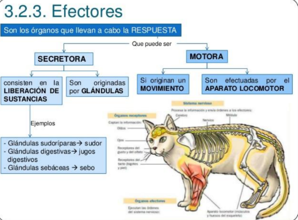
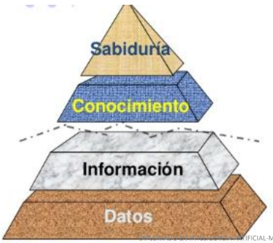
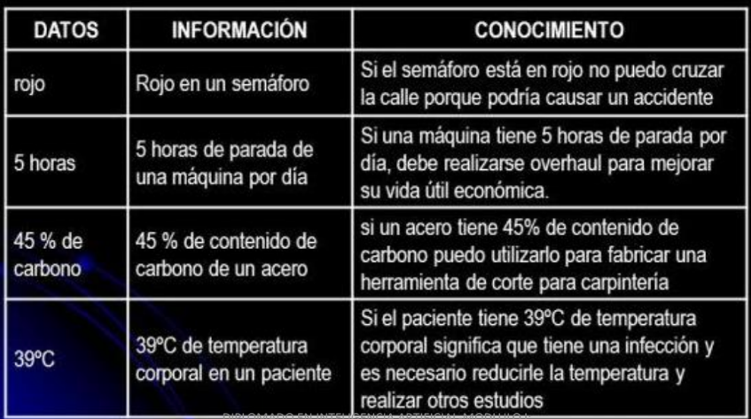
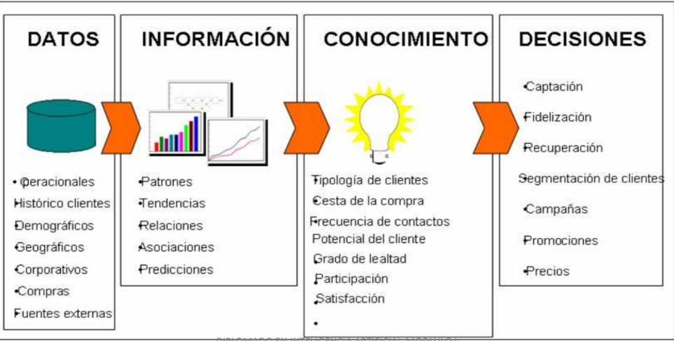
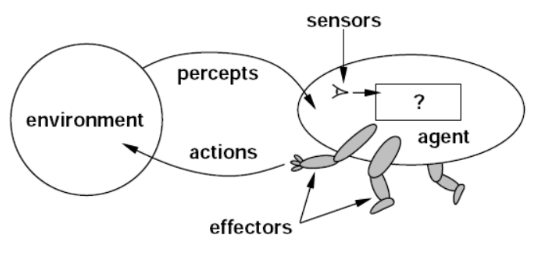
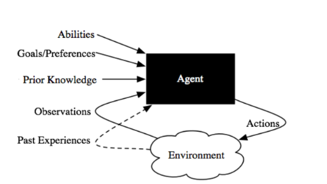

# Introducción a la Inteligencia Artificial

Este es el nota del primer modulo, gracias a [Ing. Retnato Gonzale](https://do.linkedin.com/in/renato-r-gonz%C3%A1lez-disla-70423b14/es-es)

## Objetivo

- La inteligencia artificial (IA) es un gran campo que abarca lógica,
probabilidad y matemáticas continuas; percepción, razonamiento,
aprendizaje y acción de los agentes de software y robots.
- Comprender los conceptos básicos en los que se fundamenta la
Inteligencia Artificial como disciplina que simula el comportamiento
inteligente de los humanos mediante algoritmos de máquinas, así
como comprender su evolución y el estado actual de la disciplina.

## Tabla de contenido

## Herramientas de software usadas en AI
- Python
- R
- MatLab
- IBM SPSS Modeler
- SAS

## Introducción
### Funciones vitales de los seres vivos
- Nutrición
- Reproducción
- Relación (Interacción biológica y medio ambiental que incluye la función motora)


#### Relación o Interacción biológica
- Los seres vivos procesan información de su entorno para su sobrevivencia mediante los 5 sentidos (tacto, olfato, vista, gusto y oído) que actúan como sensores de la realidad.
- Estas serán codificadas e interpretadas por el órgano cerebral para la función intelectiva y para la respuesta motora o secretora.

#### Efectores
- Los efectores son células nerviosas que ejecutan respuestas ante los estímulos que reciben. Todas las células de un animal tienen que responder de forma coordinada.
- Existen células especializadas (efectoras) en elaborar respuesta, la secreción de sustancias y el movimiento.



> Se divide en secretora y motora.
>> **Secretora**: Liberacion de sustancias y son originadas por grandulas.
>
>> **Motora**: Se originan un movimiento y son efectuadas por aparato locomotor.


### ¿Qué es la inteligencia?
Es solo el comportamiento externo el que define la inteligencia; actuar inteligentemente es ser inteligente.
Por lo tanto, la inteligencia artificial, si se logra y cuando se logre, será inteligencia real creada artificialmente.

El Test de **Allan Turing (1950)**: Es una prueba de la habilidad de una máquina de exhibir un comportamiento
inteligente similar, o indistinguible del de un humano.


```
"Inteligencia (también llamado intelecto) es un término general que se utiliza tradicionalmente para describir una propiedad de la mente...
que abarca muchas habilidades relacionadas, tales como la capacidad de razonar, planear, resolver problemas, pensamiento abstracto, de comprender las ideas, para usar el lenguaje y para aprender" - American Psychological Association

"La propiedad de algunas entidades que realizan tareas con éxito relevantes para su vida y se adaptan a los cambios del entorno" - Sternberg y Salter

"Capacidad cognitiva innata general para aprender y aplicar los conocimientos con el fin de obtener mejores resultados en un entorno" - Cyril Burt
```
### ¿Qué es aprendizaje?
- El aprendizaje es el proceso a través del cual se adquieren o modifican habilidades, destrezas, conocimientos, conductas o valores como resultado del estudio, la experiencia, la instrucción, el razonamiento y
la observación.
- El aprendizaje es una de las funciones cerebrales más importantes en humanos, animales y sistemas artificiales.

### Dato, Información y Conocimiento

- **Sabiduria**: Es una actividad en la actualidad propia de los humanos. Es una apreciación del `por qué` permite producir conocimiento.
- **Conocimiento**: Es informacion útil, contextual, táctica. Es la aplicacion de los datos y la información, responde a `cómo` permite aprender.
- **Información**: Es la data con un signoficado por via de una relacion. El significado puede o no ser útil. Reponsde a `quién, qué, donde, cuándo`.
- **Datos**: Es la data cruda, puede o nor existir, pero no posee significado.





### Interigencia Artificial
#### Definición
- La `inteligencia artificial`, o `IA`, es el campo que estudia la síntesis y el análisis de agentes computacionales que actúan de manera inteligente (simulan la inteligencia natural).
- Los `agentes` incluyen gusanos, perros, termostatos, aviones, robots, humanos, empresas y países.
- Estamos interesados en lo que hace un agente; es decir, cómo actúa.
- Juzgamos a un agente por sus acciones.
#### Agente Inteligente
- Un agente computacional es un agente cuyas decisiones sobre sus acciones pueden explicarse en términos de cálculo y algoritmo (hardware + software).
- Es una entidad que percibe y actúa. Es algo que actúa e interactúa en un entorno basado en el intercambio de la información.
- Para cualquier clase de entornos y tareas, buscamos el agente (o clase de agentes) con el mejor rendimiento
> **Advertencia**: las limitaciones computacionales hacen que a racionalidad perfecta sea inalcanzable.




Un agente actúa de manera inteligente cuando:
- Lo que hace es apropiado para sus circunstancias y sus objetivos
- Es flexible a entornos cambiantes y objetivos cambiantes
- Aprende de la experiencia
- Toma las decisiones apropiadas dadas sus limitaciones perceptivas y computacionales.



> [10 ejemplos de que ya dependes de la IA en tu vida diaria](https://www.bbvaopenmind.com/tecnologia/inteligencia-artificial/10-ejemplos-de-que-ya-dependes-de-la-ia-en-tu-vida-diaria/)


#### Prehistoria
- **Filosofía**: Lógica, métodos de razonamiento, la mente como sistema físico, fundamentos del aprendizaje, lenguaje, racionalidad.
- **Matemáticas**: Representación formal y algoritmos de prueba, cómputo, (no)decidabilidad, (in)ractabilidad, probabilidad
- **Ciencias económicas**: utilidad, teoría de la decisión
- **Neurociencia**: sustrato físico para la actividad mental
- **Psicología**: fenómenos de percepción y control motor, técnicas experimentales.
- **Ingeniería Informática**: construyendo computadoras rápidas
- **Teoría de control**: diseñar sistemas que maximicen una función objetivo a lo largo del tiempo
- **Lingüística**: representación del conocimiento, gramática

#### Historia abreviada
- MacCulloch and Pitts (1943): Neural Network
- Alan Turing Machine (1950)
- Von Neumann (1952): General Propose Computer
- Claude Shannon (1950): Information Theory
- Marvin Minsky (1951): Artificial Intelligence
- 1956 Dartmouth meeting: "Artificial Intelligence" adopted
- John MaCarthy
- Newell and Simon
- 1965 - Robinson's complete algorithm for logical
- Nathaniel Rochester - IBM
- Robotics (1970)
- 1966 to 1973 AI discovers computational complexity Languages (1975): Prolog, Modula, LISP, etc.
- Cognitive science (1980)
- AI Crisis (1980)
- 1986 - Neural networks return to popularity
- 1987 - AI becomes a science
- New paradigm in computer science (1990)
- 1995 The emergence of intelligent agents


## Referencia
[Artificial
Intelligence
Foundations of Computational Agents](https://artint.info/html/ArtInt.html)