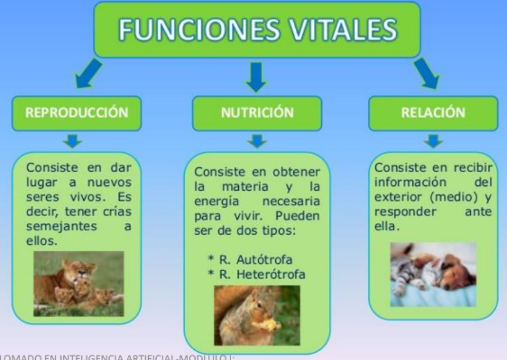
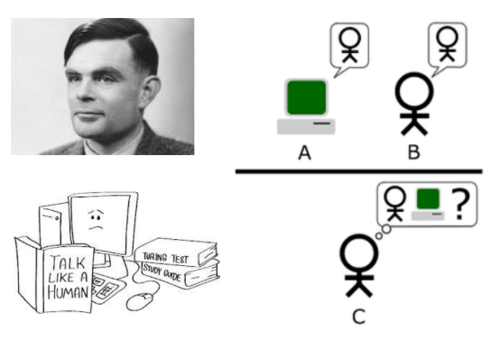
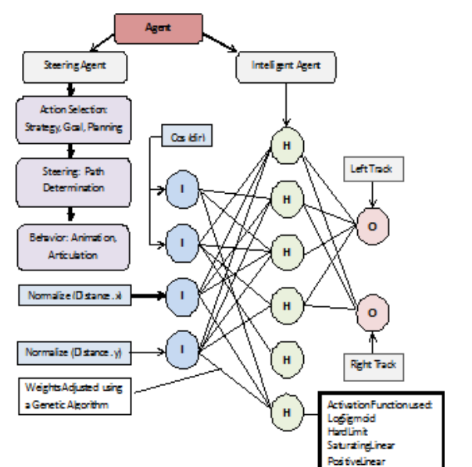
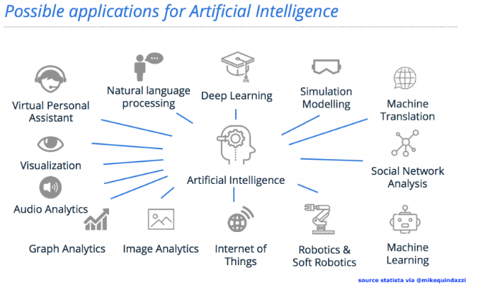
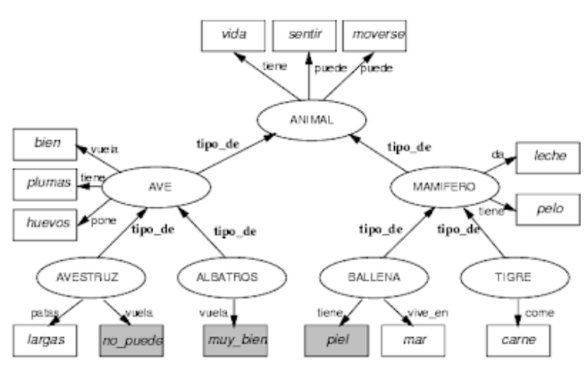
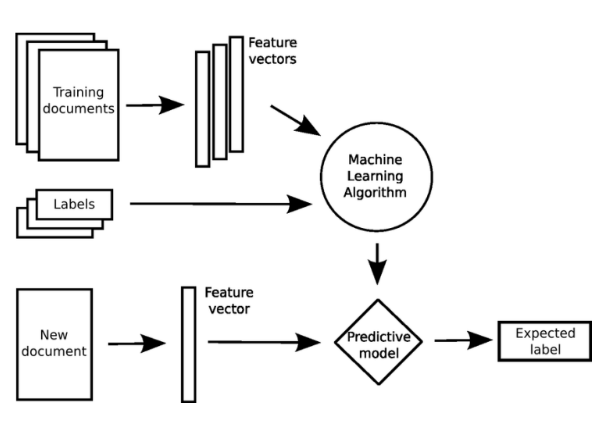

# Introducción a la Inteligencia Artificial

Este es el nota del primer modulo, gracias a [Ing. Retnato Gonzale](https://do.linkedin.com/in/renato-r-gonz%C3%A1lez-disla-70423b14/es-es)


# Objetivo

- La inteligencia artificial (IA) es un gran campo que abarca lógica,
probabilidad y matemáticas continuas; percepción, razonamiento,
aprendizaje y acción de los agentes de software y robots.
- Comprender los conceptos básicos en los que se fundamenta la
Inteligencia Artificial como disciplina que simula el comportamiento
inteligente de los humanos mediante algoritmos de máquinas, así
como comprender su evolución y el estado actual de la disciplina.

# Tabla de contenido
- [Introducción a la Inteligencia Artificial](#introducci-n-a-la-inteligencia-artificial)
- [Objetivo](#objetivo)
- [Tabla de contenido](#tabla-de-contenido)
- [Herramientas de software usadas en AI](#herramientas-de-software-usadas-en-ai)
- [Introducción](#introducci-n)
  * [Funciones vitales de los seres vivos](#funciones-vitales-de-los-seres-vivos)
    + [Relación o Interacción biológica](#relaci-n-o-interacci-n-biol-gica)
    + [Efectores](#efectores)
  * [¿Qué es la inteligencia?](#-qu--es-la-inteligencia-)
  * [¿Qué es aprendizaje?](#-qu--es-aprendizaje-)
  * [Dato, Información y Conocimiento](#dato--informaci-n-y-conocimiento)
- [Interigencia Artificial](#interigencia-artificial)
  * [Definición](#definici-n)
  * [Agente Inteligente](#agente-inteligente)
  * [Prehistoria](#prehistoria)
  * [Historia abreviada](#historia-abreviada)
- [Solución de Problemas y Espacios de Estado](#soluci-n-de-problemas-y-espacios-de-estado)
  * [¿En qué consiste un problema de espacio de estado?](#-en-qu--consiste-un-problema-de-espacio-de-estado-)
- [Algoritmos de búsqueda de grafos](#algoritmos-de-b-squeda-de-grafos)
  * [Algoritmos de Recorridos](#algoritmos-de-recorridos)
  * [Algoritmo de Búsqueda Genérico](#algoritmo-de-b-squeda-gen-rico)
  * [Estrategia de Búsqueda No-Informada](#estrategia-de-b-squeda-no-informada)
    + [Breadth First Search](#breadth-first-search)
    + [Depth First Search](#depth-first-search)
- [Componentes de Inteligencia Artificial](#componentes-de-inteligencia-artificial)
  * [Ciencias Cognitivas](#ciencias-cognitivas)
  * [Modelo Cognitivo](#modelo-cognitivo)
    + [Componetes de Modelo Cognitivo](#componetes-de-modelo-cognitivo)
      - [Percepción](#percepci-n)
      - [Atención](#atenci-n)
      - [Memoria](#memoria)
      - [Lenguaje](#lenguaje)
      - [Acción](#acci-n)
      - [Planeamiento](#planeamiento)
      - [Aprendizaje](#aprendizaje)
- [Representación del Conocimiento y Razonamiento](#representaci-n-del-conocimiento-y-razonamiento)
  * [Ontología](#ontolog-a)
  * [Redes Semánticas](#redes-sem-nticas)
- [Machine Learning](#machine-learning)
  * [Reconocimiento de patrones (Pattern Recognition)](#reconocimiento-de-patrones--pattern-recognition-)
  * [Objetivo](#objetivo-1)
  * [Tipos de Algoritmos de Aprendizaje](#tipos-de-algoritmos-de-aprendizaje)
    + [Aprendizaje Supervisado](#aprendizaje-supervisado)
    + [No Supervisados](#no-supervisados)
    + [Reforzamiento](#reforzamiento)
- [Etapas de AI (Stages of AI)](#etapas-de-ai-stages-of-ai)
- [Alcance (Scope)](#alcance-scope-)
- [Referencias](#referencias)

# Herramientas de software usadas en AI
- Python
- R
- MatLab
- IBM SPSS Modeler
- SAS

# Introducción
## Funciones vitales de los seres vivos
- Nutrición
- Reproducción
- Relación (Interacción biológica y medio ambiental que incluye la función motora)



### Relación o Interacción biológica
- Los seres vivos procesan información de su entorno para su sobrevivencia mediante los 5 sentidos (tacto, olfato, vista, gusto y oído) que actúan como sensores de la realidad.
- Estas serán codificadas e interpretadas por el órgano cerebral para la función intelectiva y para la respuesta motora o secretora.

### Efectores
- Los efectores son células nerviosas que ejecutan respuestas ante los estímulos que reciben. Todas las células de un animal tienen que responder de forma coordinada.
- Existen células especializadas (efectoras) en elaborar respuesta, la secreción de sustancias y el movimiento.


> Se divide en secretora y motora.
>> **Secretora**: Liberacion de sustancias y son originadas por grandulas.
>
>> **Motora**: Se originan un movimiento y son efectuadas por aparato locomotor.


## ¿Qué es la inteligencia?
Es solo el comportamiento externo el que define la inteligencia; actuar inteligentemente es ser inteligente.
Por lo tanto, la inteligencia artificial, si se logra y cuando se logre, será inteligencia real creada artificialmente.

El Test de **Allan Turing (1950)**: Es una prueba de la habilidad de una máquina de exhibir un comportamiento
inteligente similar, o indistinguible del de un humano.



```
"Inteligencia (también llamado intelecto) es un término general que se utiliza tradicionalmente para describir una propiedad de la mente...
que abarca muchas habilidades relacionadas, tales como la capacidad de razonar, planear, resolver problemas, pensamiento abstracto, de comprender las ideas, para usar el lenguaje y para aprender" - American Psychological Association

"La propiedad de algunas entidades que realizan tareas con éxito relevantes para su vida y se adaptan a los cambios del entorno" - Sternberg y Salter

"Capacidad cognitiva innata general para aprender y aplicar los conocimientos con el fin de obtener mejores resultados en un entorno" - Cyril Burt
```
## ¿Qué es aprendizaje?
- El aprendizaje es el proceso a través del cual se adquieren o modifican habilidades, destrezas, conocimientos, conductas o valores como resultado del estudio, la experiencia, la instrucción, el razonamiento y
la observación.
- El aprendizaje es una de las funciones cerebrales más importantes en humanos, animales y sistemas artificiales.

## Dato, Información y Conocimiento

- **Sabiduria**: Es una actividad en la actualidad propia de los humanos. Es una apreciación del `por qué` permite producir conocimiento.
- **Conocimiento**: Es informacion útil, contextual, táctica. Es la aplicacion de los datos y la información, responde a `cómo` permite aprender.
- **Información**: Es la data con un signoficado por via de una relacion. El significado puede o no ser útil. Reponsde a `quién, qué, donde, cuándo`.
- **Datos**: Es la data cruda, puede o nor existir, pero no posee significado.


# Interigencia Artificial
## Definición
- La `inteligencia artificial`, o `IA`, es el campo que estudia la síntesis y el análisis de agentes computacionales que actúan de manera inteligente (simulan la inteligencia natural).
- Los `agentes` incluyen gusanos, perros, termostatos, aviones, robots, humanos, empresas y países.
- Estamos interesados en lo que hace un agente; es decir, cómo actúa.
- Juzgamos a un agente por sus acciones.
## Agente Inteligente
- Un agente computacional es un agente cuyas decisiones sobre sus acciones pueden explicarse en términos de cálculo y algoritmo (hardware + software).
- Es una entidad que percibe y actúa. Es algo que actúa e interactúa en un entorno basado en el intercambio de la información.
- Para cualquier clase de entornos y tareas, buscamos el agente (o clase de agentes) con el mejor rendimiento
> **Advertencia**: las limitaciones computacionales hacen que a racionalidad perfecta sea inalcanzable.




Un agente actúa de manera inteligente cuando:
- Lo que hace es apropiado para sus circunstancias y sus objetivos
- Es flexible a entornos cambiantes y objetivos cambiantes
- Aprende de la experiencia
- Toma las decisiones apropiadas dadas sus limitaciones perceptivas y computacionales.


> [10 ejemplos de que ya dependes de la IA en tu vida diaria](https://www.bbvaopenmind.com/tecnologia/inteligencia-artificial/10-ejemplos-de-que-ya-dependes-de-la-ia-en-tu-vida-diaria/)


## Prehistoria
- **Filosofía**: Lógica, métodos de razonamiento, la mente como sistema físico, fundamentos del aprendizaje, lenguaje, racionalidad.
- **Matemáticas**: Representación formal y algoritmos de prueba, cómputo, (no)decidabilidad, (in)ractabilidad, probabilidad
- **Ciencias económicas**: utilidad, teoría de la decisión
- **Neurociencia**: sustrato físico para la actividad mental
- **Psicología**: fenómenos de percepción y control motor, técnicas experimentales.
- **Ingeniería Informática**: construyendo computadoras rápidas
- **Teoría de control**: diseñar sistemas que maximicen una función objetivo a lo largo del tiempo
- **Lingüística**: representación del conocimiento, gramática

## Historia abreviada
- MacCulloch and Pitts (1943): Neural Network
- Alan Turing Machine (1950)
- Von Neumann (1952): General Propose Computer
- Claude Shannon (1950): Information Theory
- Marvin Minsky (1951): Artificial Intelligence
- 1956 Dartmouth meeting: "Artificial Intelligence" adopted
- John MaCarthy
- Newell and Simon
- 1965 - Robinson's complete algorithm for logical
- Nathaniel Rochester - IBM
- Robotics (1970)
- 1966 to 1973 AI discovers computational complexity Languages (1975): Prolog, Modula, LISP, etc.
- Cognitive science (1980)
- AI Crisis (1980)
- 1986 - Neural networks return to popularity
- 1987 - AI becomes a science
- New paradigm in computer science (1990)
- 1995 The emergence of intelligent agents

# Solución de Problemas y Espacios de Estado
- El agente puede determinar cómo lograr su objetivo buscando en su representación del espacio de estado una forma de pasar de su estado actual a un estado que satisfaga su objetivo.
- Dado un modelo completo, trata de encontrar una secuencia de acciones que logren su objetivo antes de que tenga que actuar en el mundo.
- Luego procede a actuar, tomar decisiones y aprender

## ¿En qué consiste un problema de espacio de estado?
- Un conjunto de estados
- Un subconjunto de estados llamados `estados de inicio`
- Un conjunto de acciones
- Una función de acción: dado un estado y una acción, devuelve un nuevo estado
- Un conjunto de estados de objetivo, especificados como función, objetivo(s)
- Un criterio que especifica la calidad de una solución aceptable.


Una formulación general de la acción inteligente es en términos de un **espacio de estado**.
Un estado contiene toda la información necesaria para **predecir los efectos de una acción y para determinar si un estado satisface el objetivo**.

La **búsqueda en el espacio de estado** supone:
- El agente tiene un conocimiento perfecto del espacio de estado y está planeando el caso en el que observa en qué estado se encuentra: hay una total observabilidad.
- El agente tiene un conjunto de acciones que tienen efectos deterministas conocidos.
- El agente puede determinar si un estado satisface la meta.

> Se consideran sucesivos estados de una instancia, con la meta de encontrar un **estado final** con las características deseadas.

> Los problemas se modelan a menudo como un espacio de estados, un conjunto de **estados** que contiene el `problema`. El conjunto de **estados** forma un `grafo` donde dos estados están conectados si hay una `operación` que pueda se pueda llevar a cabo para **transformar el primer estado en el segundo**.

# Algoritmos de búsqueda de grafos
## Algoritmos de Recorridos
- El problema de encontrar una secuencia de acciones para lograr un objetivo se resume en la búsqueda de rutas en grafos dirigidos.
- Para resolver un problema, primero defina el espacio de búsqueda subyacente y luego aplique un algoritmo de búsqueda a ese espacio de búsqueda.
- Este problema puede resumirse en el problema matemático de encontrar una ruta desde el nodo de inicio a un nodo objetivo en un gráfico dirigido.


- Muchas tareas de resolución de problemas son transformables en el problema de encontrar una ruta en un gráfico.
- La búsqueda en gráficos proporciona un modelo abstracto apropiado de resolución de problemas independiente de un dominio particular.
> Ejemplo: encontrar la ruta de más corto entre dos nodos.

## Algoritmo de Búsqueda Genérico
- Estos algoritmos especifican un orden para buscar a través de los nodos de un gráfico.
- Comenzamos en el nodo de origen y seguimos buscando hasta encontrar el nodo de destino.
- La frontera contiene nodos que hemos visto pero que aún no hemos explorado.
- Cada iteración, sacamos un nodo de la frontera y agregamos sus vecinos a la frontera hasta que se encuentre un nodo objetivo.
> Ejemplo: La mapas busca la mejor ruta podría significar:
> - La ruta más corta (menos distancia)
> - La ruta más rápida
> - La ruta de menor costo que tiene en cuenta el tiempo, el dinero (por ejemplo, combustible y peajes) y el atractivo de la ruta.


## Estrategia de Búsqueda No-Informada
Estrategias de búsqueda desinformadas que no tienen en cuenta la ubicación del objetivo.
Intuitivamente, estos algoritmos ignoran a dónde van hasta que encuentran un objetivo e informan de éxito:
- Depth-First Search
- Iterative Deepening
- Lowest-Cost-First Search

> Una `estrategia de búsqueda` define el orden en que se seleccionan las rutas desde la frontera.

### Breadth First Search
- En breadth-first search la frontera se implementa como una cola `FIFO` (primero en entrar, primero en salir).
- Por lo tanto, la ruta que se selecciona desde la frontera es la que se agregó antes.
- Este enfoque implica que las rutas desde el nodo de inicio se generan en orden de la cantidad de arcos en la ruta.
- Se selecciona uno de los caminos con la menor cantidad de arcos en cada iteración.


### Depth First Search
- En depth-first search, la frontera actúa como una pila de caminos `LIFO` (último en entrar, primero en salir). En una pila, los elementos se agregan y eliminan de la parte superior de la pila.
- Usar una pila significa que la ruta seleccionada y eliminada de la frontera en cualquier momento es la última ruta que se agregó.


# Componentes de Inteligencia Artificial
La definición generalizada de Inteligencia Artificial es: `un programa de computadora que puede llevar a cabo una simulación completa del cerebro humano.`
La **Artificial** esta constituida por un conjunto de disciplinas interrelacionadas


La IA está inspirada en la biología, las matemáticas, la física, la estadística, las ciencias cognitivas, la informática y la ingeniería de software.

## Ciencias Cognitivas
- La ciencia cognitiva es el estudio interdisciplinario y científico de la mente y sus procesos. Examina la naturaleza, las tareas y las funciones de la cognición (en un sentido amplio).
- Los `científicos cognitivos` estudian la inteligencia y el comportamiento, centrándose en `cómo los sistemas nerviosos representan, procesan y transforman la información`.


## Modelo Cognitivo
El `modelado cognitivo` es un área de la informática que se ocupa de simular la resolución de problemas humanos y el procesamiento mental en un modelo computarizado.


- El `sistema nervioso` es una parte altamente compleja de un animal que coordina sus acciones e información sensorial mediante la transmisión de señales hacia y desde diferentes partes de su cuerpo.
- El `sistema nervioso` detecta cambios ambientales que afectan el cuerpo, luego trabaja en conjunto con el sistema endocrino para responder a tales eventos.
- El `cerebro` es un órgano que sirve como centro del sistema nervioso en todos los vertebrados y la mayoría de los animales invertebrados.
- El `cerebro` está ubicado en la cabeza, generalmente cerca de los órganos sensoriales para sentidos como la visión.
- El `cerebro` es el órgano más complejo del cuerpo de un vertebrado.

### Componetes de Modelo Cognitivo
- Dicho modelo se puede utilizar para simular o predecir el comportamiento o el desempeño humano en tareas similares a las modeladas y mejorar la interacción humano-computadora.


> - LTM: Long-term memory
> - STM: Short-term memory
> - SM: Sensory memory

#### Percepción
- Es la organización, identificación e interpretación de la información sensorial para representar y comprender la información presentada o el entorno.
- Toda `percepción` implica señales que pasan por el sistema nervioso, que a su vez resultan de la estimulación física o química del sistema sensorial.
> Ejemplo: la visión implica que la luz golpe la retina del ojo, el olor está mediado por moléculas de olor y la audición implica ondas de presión.

#### Atención
- Es la concentración de la conciencia sobre algún fenómeno con exclusión de otros estímulos.
- En los años siguientes, se hizo menos hincapié en el elemento subjetivo de la conciencia y más en los patrones de comportamiento por los cualesla atención podría ser reconocida en los demás.


#### Memoria
- **Teoría del procesamiento de información cognitiva (CIP)**
- Esta no es una sola teoría, sino un término genérico utilizado para describir todas las perspectivas que enfocan cómo nuestros
procesos cognitivos, como `la atención, la percepción, la codificación, el almacenamiento y la recuperación del conocimiento`.
- Utiliza un modelo de dos almacenamientos donde los estímulos ingresan al `Registro sensorial y desde allí van a la Memoria a corto plazo`.
- Aquí a través del `ensayo y la codificación` pueden almacenarse en la memoria a `largo plazo`.

")

#### Lenguaje
- El `lenguaje` es un sistema de símbolos y reglas que se utiliza para una comunicación significativa.
- Un `lenguaje` usa símbolos, que son sonidos, gestos o caracteres escritos que representan objetos, acciones, eventos e ideas.
- Los símbolos permiten a las personas referirse a objetos que están en otro lugar o eventos que ocurrieron en un momento diferente.

> Categoria de Lenguaje
> - Comunicación
> - Música (representación de la emoción)
> - Matemáticas

#### Acción
- Se refiriere a la salida o producción de un sistema. En humanos, esto se logra a través de respuestas motoras.
- La planificación espacial y el movimiento, la producción del habla y los movimientos motores complejos son aspectos de la acción.


#### Planeamiento
- Abarca los procesos neurológicos involucrados en la formulación, evaluación y selección de una secuencia de pensamientos y acciones para lograr el objetivo deseado.

#### Aprendizaje
- El aprendizaje se puede definir de muchas maneras, pero la mayoría de los psicólogos estarían de acuerdo en que es un cambio relativamente permanente en el comportamiento que resulta de la experiencia.
- A diferencia de los cambios a corto plazo en el comportamiento (por ejemplo, los causados por la fatiga), el aprendizaje implica cambios a largo plazo, pero no necesariamente como los asociados con el envejecimiento o el desarrollo.

# Representación del Conocimiento y Razonamiento
- Representación del conocimiento y el razonamiento (`KR`, `KR&R`) incorpora los hallazgos de la psicología sobre cómo los humanos resuelven problemas y representan el conocimiento para diseñar formalismos que harán que los
sistemas complejos sean más fáciles de diseñar y construir.
- La representación del conocimiento y el razonamiento también incorporan hallazgos de la lógica para automatizar varios tipos de razonamiento, `como la aplicación de reglas o las relaciones de conjuntos y subconjuntos`


- Como parte del diseño de un programa para resolver problemas, debemos definir cómo se representará el conocimiento.

La `solución de la hipótesis` de tres niveles en razonamiento y problemas:
- **Semántica**: definición del problema y solución conceptual
- **Sintáctico**: solución algorítmica utilizando lenguaje y procedimiento simbólico.
- **Computacional(pragmático)**: entorno de proceso y recursos físicos.


La `visión clásica y conexionista de la computación`:
- **Símbolos formales**: un sistema es un compuesto sintáctico de símbolos y reglas de inferencia (cálculo proposicional y predicado).
- **Conexiones de red**: el conocimiento se representa como un patrón de activación o pesos que se distribuye a través de una red.


## Ontología
La representación del conocimiento basada en `ontología` y las técnicas de razonamiento proporcionan un conocimiento sofisticado sobre el entorno para procesar tareas o métodos.

La `Ontología` ayuda a representar el conocimiento sobre el entorno, los objetos, los eventos y las acciones que permiten la planificación de rutas y hacen que los robots sean más autónomos.


> Se discute la ontología en la representación del conocimiento estructural que ayuda a las representaciones
`semánticas`, `temporales` y `espaciales de un entorno modelado`.

## Redes Semánticas
- Una red semántica o esquema de representación en Red es una forma de representación del `conocimiento lingüístico` en la que los conceptos y sus interrelaciones se representan mediante un grafo.
- En caso de que no existan ciclos, estas redes pueden ser visualizadas como árboles.
- De mucha utilidad en el procesamiento de lenguajes naturales (NLP).



# Machine Learning
- El principio del `aprendizaje automático` es que, en lugar de tener que aprender a hacer todo paso a paso, las máquinas pueden aprender a trabajar y mejorar observando, clasificando y fallando, al igual que los humanos.
- El `machine learning` es un método de análisis de datos que automatiza la construcción de modelos analíticos.
- Es una rama de la `inteligencia artificial` basada en la idea de que los sistemas pueden aprender de datos, identificar patrones y tomar decisiones con mínima intervención humana.
> Aprendizaje basado en Teoría Estadística del Aprendizaje.


## Reconocimiento de patrones (Pattern Recognition)
- Es una regularidad en la naturaleza, en el diseño hecho por el hombre o en las ideas abstractas.
- Como tal, los elementos de un `patrón` se repiten de **manera predecible**.
> Ejemplo: Un `patrón geométrico` es un tipo de patrón formado por formas geométricas y, por lo general, se repite como un diseño tapiz.
- El reconocimiento de patrones es el reconocimiento automático de patrones y regularidades en los datos.
- El campo del reconocimiento de patrones tiene que ver con el descubrimiento automático de regularidades en los datos mediante el uso de algoritmos informáticos y con el uso de estas regularidades para realizar acciones como clasificar los datos en diferentes categorías.
- La inteligencia artificial y el aprendizaje automático, junto con aplicaciones como la minería de datos y el descubrimiento de conocimiento en bases de datos (KDD), y a menudo se usan indistintamente con estos términos.
- Los patrones emergen de los datos de una población cuando incrementamos el tamaño de la muestra en relación a ciertos atributos (Ley de los Grandes Números).
- Presentan cierta regularidad.
> Ejemplo: la edad y la
estatura se comportan
como una función normal
(Gauss).

- Los objetos de cada clase responden a una distribución de frecuencia o de probabilidad que poseen cada una sus propiedades características:
  * Promedios
  * Modas
  * Varienza
  * Etc

## Objetivo
Es diseñar y construir maquinas que puedan reconocer patrones de señales de la realidad circundante
Ejemplos:
- Reconocimiento de voz (Speech recognition)
- Identificación de huellas digitales (Fingerprint identification)
- Reconocimiento óptico de caracteres OCR (Optical Character Recognition)
- Identificación de secuencias de ADN.
- Estructuras Dinámicas Caóticas(Fractales)

## Tipos de Algoritmos de Aprendizaje


Los algoritmos se clasifican en tres tipos:
- Supervisado
- No-Supervisado
- Por reforzamiento


### Aprendizaje Supervisado 
Es una técnica para deducir una función de clasificación de objetos a partir de datos de entrenamiento.
- El `objetivo` es el de crear una función capaz de predecir el valor correspondiente a cualquier objeto de entrada.
- Los `datos de entrenamiento` consisten de pares de objetos (normalmente vectores): una componente del par son los datos de entrada y el otro, los resultados deseados.
- La `salida de la función` puede ser un valor numérico (como en los problemas de regresión) o una etiqueta de clase (como en los de clasificación).



> Enfoques: 
> - Basado en modelos de regresión (LR, Cox, GLM, etc.)
> - Basado en clasificadores con discriminantes lineales o no lineales (SVM, Neural Network, etc.)
> - Basado en reglas asociativas predictivas y en arboles de decisión (CHAID, C5, Bayes, etc.).

### No Supervisados
Los algoritmos de Aprendizaje no Supervisados infieren patrones de un conjunto de datos sin referencia a resultados conocidos o etiquetados.
Los algoritmos mas famosos son:
- K-Medias
- Clusterización Jerárquica
- Density Based Scan Clustering (DBSCAN)
- Modelo de Agrupamiento Gaussiano


### Reforzamiento
El aprendizaje por refuerzo es una área de la inteligencia artificial que esta centrada en descubrir que acciones se debe tomar para maximizar la señal de recompensa, en otras palabras se centra en como mapear situaciones a acciones que se centren en encontrar dicha recompensa.

> Al agente no se le dice que acciones tomar, si no al contrario el debe experimentar para encontrar que acciones lo llevan a una mayor recompensa, los casos mas desafiantes son los que no llevan a una recompensa inmediata si no en la siguientes situaciones.


# Etapas de AI (Stages of AI)
La primera etapa está limitada a una solo área funcional, en la segunda etapa, la IA debería poder combinar diferentes áreas estrechas para realizar tareas en un nivel de habilidad humana.


# Alcance (Scope)
El alcance de la `Inteligencia Artificial` es mucho más amplio e incluye tecnologías como el procesamiento del lenguaje natural, el aprendizaje automático, el aprendizaje simbólico, el robot y muchos otros.

# Referencias
[Artificial
Intelligence
Foundations of Computational Agents](https://artint.info/html/ArtInt.html)

[AI by Ing. Retnato Gonzale part 1](data/1.pdf)

[AI by Ing. Retnato Gonzale part 2](data/2.pdf)

[AI by Ing. Retnato Gonzale part 3](data/3.pdf)